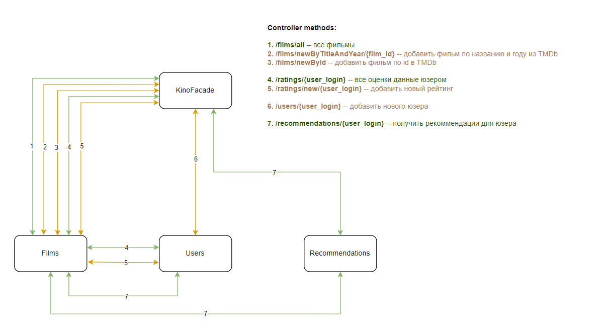

# kino-service
Course project on the topic `"Development of film recommendation system"` made for Tinkoff fintech program in 2023.

Project has microservice architecture and `RabbitMQ` is used for communication.

Consequently, queues are build in that way. Not all of it are specified on the picture, but the main scheme.

Recommendations are being automatically refreshed every minute, for development purpose.

Also, `TMDb API` was used to get information about films.